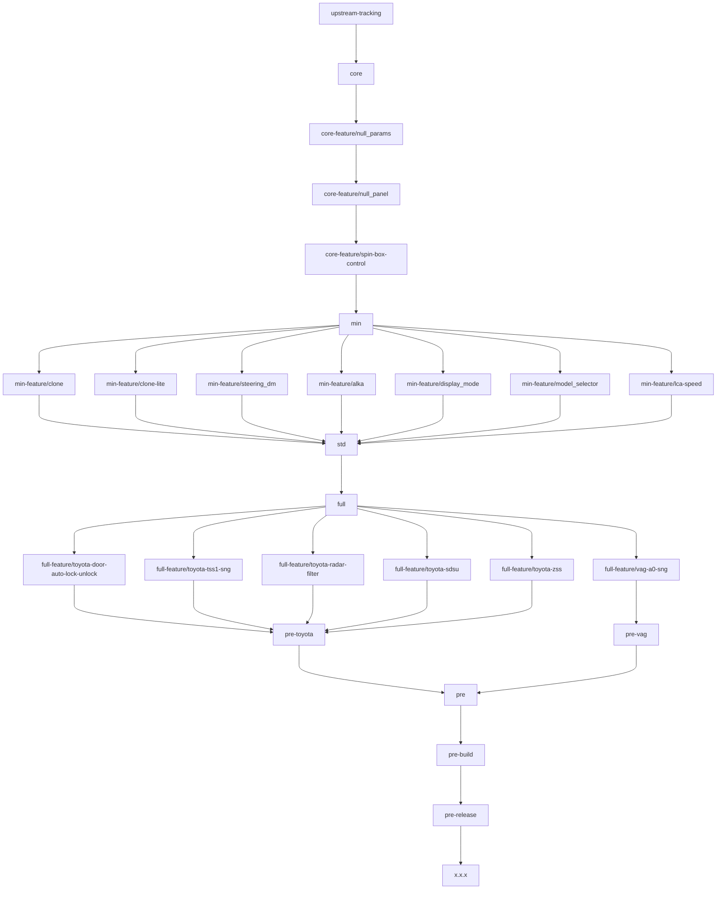

```mermaid
flowchart TD
    B000["upstream-tracking"] ---> CORE["core"]
    CORE ---> CORE_001["core-feature/null_params"]
    CORE_001 ---> CORE_002["core-feature/null_panel"]
    CORE_002 ---> CORE_003["core-feature/spin-box-control"]
    CORE_003 ---> MIN["min"]
    MIN ---> MIN_001["min-feature/clone"]
    MIN ---> MIN_002["min-feature/clone-lite"]
    MIN ---> MIN_003["min-feature/steering_dm"]
    MIN ---> MIN_004["min-feature/alka"]
    MIN ---> MIN_005["min-feature/display_mode"]
    MIN ---> MIN_006["min-feature/model_selector"]
    MIN ---> MIN_007["min-feature/lca-speed"]
    MIN_001 ---> STD["std"]
    MIN_002 ---> STD
    MIN_003 ---> STD
    MIN_004 ---> STD
    MIN_005 ---> STD
    MIN_006 ---> STD
    MIN_007 ---> STD
    STD ---> FULL["full"]
    FULL ---> TOYOTA_001[full-feature/toyota-door-auto-lock-unlock]
    FULL ---> TOYOTA_002[full-feature/toyota-tss1-sng]
    FULL ---> TOYOTA_003[full-feature/toyota-radar-filter]
    FULL ---> TOYOTA_004[full-feature/toyota-sdsu]
    FULL ---> TOYOTA_005[full-feature/toyota-zss]
    FULL ---> VAG_001[full-feature/vag-a0-sng]
    TOYOTA_001 ---> TOYOTA[pre-toyota]
    TOYOTA_002 ---> TOYOTA
    TOYOTA_003 ---> TOYOTA
    TOYOTA_004 ---> TOYOTA
    TOYOTA_005 ---> TOYOTA
    VAG_001 ---> VAG[pre-vag]
    TOYOTA ---> PRE[pre]
    VAG ---> PRE
    PRE ---> PRE_001[pre-build]
    PRE_001 ---> PRERELEASE[pre-release]
    PRERELEASE ---> RELEASE[x.x.x]
```
